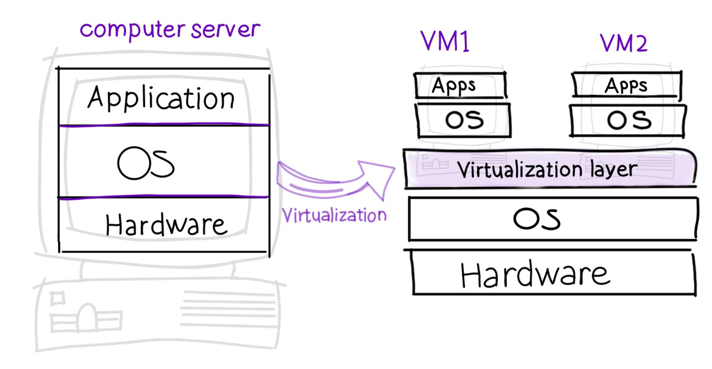

# **Understanding Virtual Machines**

## **How Virtual Machines Work**

A **Virtual machine** (VM) is a software emulation of a physical computer, acting like a real computer that runs its own operating system and applications, just like a physical computer would.

**Virtualization** involves creating software-based versions of physical components, such as servers, desktops, storage devices, and network resources. These virtual resources utilize dedicated amounts of CPU, memory, and storage from a physical host. A **hypervisor**, also known as a virtual machine monitor (VMM), is the software that creates and runs VMs. It abstracts the host's physical hardware resources and allocates them to VMs, treating these resources as a pool that can be shared among existing VMs or allocated to new ones. 

The physical machine that runs the hypervisor is called the host machine, or simply the host, while the VMs that utilize its resources are known as guest machines, or guests. The hypervisor ensures that each guest machine operates independently and is isolated from others, providing secure and efficient management of multiple operating systems on a single physical machine.

In Born2beRoot project, [Oracle VM VirtualBox](https://en.wikipedia.org/wiki/VirtualBox) is recommended for creating and managing VMs. It's an open-source hosted hypervisor that you will find on your computer at a 42 School. Otherwise you can [install it](https://www.virtualbox.org/manual/ch02.html). It is an example of Type 2 or hosted hypervisor that works by running on top of the host's existing operating system (OS) just like any regular application would.

There are also Type 1 or bare metal hypervisors, which run directly on the host's hardware to control the hardware and manage guest operating systems.

## Operating System**s on Virtual Machines**

An **Operating System** (OS) is a crucial piece of software that controls the computer's hardware and software resources and provides general services for computer applications. In other words, it is the bridge between the user, the programs, and the hardware of the computer.

You can set up an operating system on virtual machines with an ISO image file. This file can be added in the VM settings, working like a real install disk.

When setting up a VM for the Born2beRoot project, you have the option to choose between Debian or Rocky. Both are open-source, free to use, and highly regarded for their stability and security, making them excellent choices for server use.

### Debian vs **Rocky** OS

**Debian** has a rich history dating back to the 1990s, with a strong commitment to the principles of free software. It's developed and maintained by a huge community, ensuring a stable and widely compatible operating system. Debian includes the Advanced Packaging Tool (APT) for easy software management, making it accessible for newcomers and skilled administrators alike.

**Rocky Linux** is a new member of the Linux family, designed to work in a similar way to Red Hat Enterprise Linux, a version of Linux developed specifically for businesses and enterprises. However, you don't need to have a subscription to use Rocky Linux. This makes it an excellent choice for users seeking an OS that aligns with enterprise standards but prefer a community-supported model.

In the Born2beRoot project, you'll dive into system administration by installing and configuring one of these operating systems on a VM. You'll practice partitioning, managing users, and improving security, which are all key skills for a system administrator.

Utilizing VMs for this project allows for a safe, flexible learning environment. You can experiment with different settings and configurations without risking a physical system, making it an ideal setup for education and exploration.

If you are a beginner, 42 recommends that you use Debian.

<aside>
📌 I picked Debian for my Born2beRoot project because it's easy to use and has strong community support.

</aside>

## **Why use a Virtual Machine**

Using a virtual machine is a smart choice for many reasons. It's like having several computers inside your main one, which saves money and space.

When a physical server crashes, it can be complex to recover the data it contained. The software aspect of VMs simplifies data backup. While your VM is running, it is possible to obtain a backup thanks to a snapshot of the VM and its data. In case of an incident, this snapshot allows you to restore the VM to its previous state.

VMs are also great for keeping your computer safe from viruses. Since each VM is separate from the others and from your main computer, a virus in one VM won't spread to the rest. This means you can try new things or open risky files in a VM without worrying about harming your main computer.

People use VMs for all sorts of things. Developers test new apps on VMs to make sure they work right without messing up their main computer. Students and teachers use VMs to learn about different software and computer setups safely. You can even use VMs to run old games or programs that don't work on new computers anymore.

**In summary**, virtual machines offer a flexible, efficient, and secure way to manage computing resources, making them an invaluable tool in software development, education, IT management, and personal computing. With virtual machines, you can do more with your computer without the risk of breaking anything.
